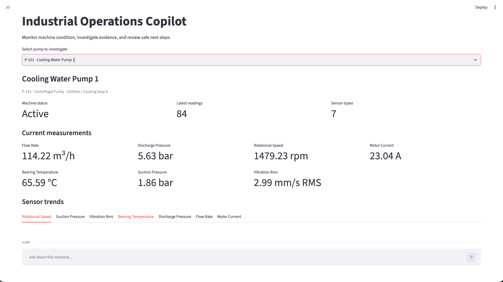
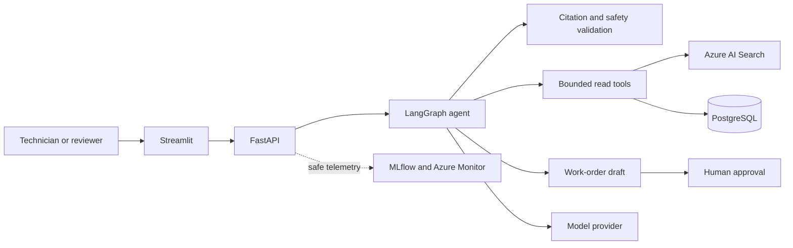

# Industrial AI Operations Copilot

Industrial AI Operations Copilot is a production-oriented portfolio project for
troubleshooting centrifugal pumps. It combines approved technical documents,
synthetic sensor readings, maintenance history, and incident records to produce
structured recommendations with traceable evidence.

The system is decision support, not an industrial control system. It cannot
control equipment. Read tools are bounded, write proposals require payload-bound
human approval, and unsafe or insufficiently grounded requests fail safely.

## What the project demonstrates

- typed domain, API, database, tool, and agent contracts;
- PostgreSQL persistence with Alembic migrations and deterministic seed data;
- hybrid retrieval over revision-controlled technical documents;
- a bounded LangGraph diagnostic workflow with citations and safety guardrails;
- approval, expiry, replay protection, and feedback-to-evaluation traceability;
- FastAPI and Streamlit delivery with correlation IDs and structured errors;
- MLflow-compatible tracing, privacy-safe logging, metrics, and dashboards;
- deterministic release evaluation with latency, cost, grounding, and safety gates;
- Docker-based local delivery and Azure Bicep with managed identity and least privilege;
- GitHub Actions for quality, security, immutable images, staged deployment, and rollback;
- bounded retry, backoff, circuit breaking, fallback, and graceful degradation.

## Architecture at a glance



See the [portfolio architecture](docs/portfolio/architecture.md),
[system overview](docs/architecture/system-overview.md), and
[Azure architecture](docs/architecture/azure-architecture.md) for trust
boundaries and deployment detail.

## Quick start

Prerequisites:

- Git;
- Docker Engine or Docker Desktop with Docker Compose v2.

Clone the repository, then from its root create the local configuration:

```bash
cp .env.example .env
docker compose up --build --wait
```

On PowerShell, use:

```powershell
Copy-Item .env.example .env
docker compose up --build --wait
```

Open:

- Streamlit: <http://localhost:8501>
- FastAPI documentation: <http://localhost:8000/docs>
- MLflow tracing and experiments: <http://localhost:5001>
- liveness: <http://localhost:8000/health>
- dependency readiness: <http://localhost:8000/ready>

The local stack uses mock runtime adapters and synthetic records. It requires no
Azure credentials or paid model call. Follow the [demo guide](docs/portfolio/demo-guide.md)
for a reviewable walkthrough and the [local development guide](docs/operations/local-development.md)
for lifecycle and troubleshooting commands.

Stop the stack without deleting its database:

```bash
docker compose down
```

## Development checks

Install the locked environment and run the same quality gates as CI:

```bash
uv sync --locked --all-groups
uv run ruff check .
uv run ruff format --check .
uv run mypy app frontend tests evaluation scripts
uv run pytest -q
uv run python -m scripts.run_evaluation \
  --output evaluation/reports/phase18-reference.json
uv run python -m scripts.validate_portfolio
```

The integration suite uses PostgreSQL when `TEST_DATABASE_URL` is configured and
skips environment-specific tests when their required service is unavailable.

## Evaluation results

The versioned reference dataset contains three deterministic cases. All three
pass the configured release gates. Recorded fixture latency ranges from 45 ms to
1,800 ms and estimated fixture cost ranges from USD 0.000 to USD 0.024 per case.
These are reference-fixture values, not production SLA or billing claims.

See [results and lessons](docs/portfolio/results-and-lessons.md) for the dataset
identity, thresholds, aggregate results, charts, reproduction command, and
interpretation limits.

## Azure delivery

Bicep declares isolated development, staging, and production resources for
Container Apps, ACR, PostgreSQL, AI Search, Blob Storage, Key Vault, managed
identities, Application Insights, and Log Analytics. GitHub Actions uses OIDC,
immutable image digests, protected environments, retained evidence, what-if, and
staged promotion.

Infrastructure code proves the declared design; it does not prove that a live
subscription was deployed. Live deployment claims require retained artifacts for
the exact commit. See the [Azure deployment runbook](docs/operations/azure-deployment.md)
and [staging readiness review](docs/operations/staging-readiness.md).

## Safety and scope

The MVP supports centrifugal pumps and synthetic data. It deliberately excludes:

- autonomous equipment control;
- direct production SAP, CMMS, IoT Hub, or PLC integration;
- unrestricted SQL or arbitrary tool execution;
- approval-free writes;
- claims that deterministic reference latency represents production performance.

Review [limitations](docs/portfolio/limitations.md) before interpreting the demo
and [roadmap](docs/portfolio/roadmap.md) before extending its scope.

## Portfolio evidence

The [portfolio delivery index](docs/portfolio/README.md) links architecture,
demo, evaluation evidence, Azure deployment, limitations, lessons learned,
roadmap, and the final Definition of Done. Architecture decisions are recorded
under [`docs/adr`](docs/adr/).

## License

No license has been declared in this repository. Treat the source as all rights
reserved until the maintainers add an explicit license.
